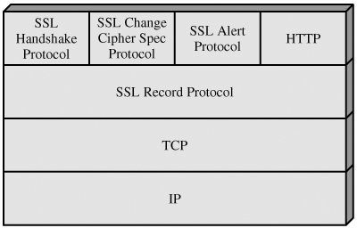

SSL (Secure Socket Layer)
==============
SSL was originated by Netscape
Netscape(Internet Explorer이전에 많이 사용되던 브라우저.)

SSL v3(version3) 표준화 한거
internet draft
일반적으로 industry에서 많이 쓰는 것

TLS는 표준 실제로 IETF협회에서

TCP에 의존하는 set of protocol

SSL Record Protocol Operation
-------------

1. Fragmentation
2의 14승 byte 나 그보다 작은 block들로 쪼갠다.

(optional) 2. Compression
- 이때 중요한 것은 lossless ( 손실 없이 데이터의 압축이 이뤄져야 한다 )
- content length가 넘어가더라도 1024byte보다 더 증가하면 안됨
( 압축한다는 것은 data size가 줄어든다는 소린데, 증가하면 안된다는게 무슨 말??
  압축하고자 하는 data block이 아주 작을 경우에는 압축하고 나서 거기에 필요한 formatting, conversion등에 필요한 extra데이터를 붙여야함. 그런 데이터들을 붙임으로 인해서 오히려 압축을 하고 나서 데이터가 더 커질 수 있음. 따라서 이 경우에 커지더라도 1024byte를 넘지는 말아라~ 더 커져서는 안된다
  일반적으로는 compression을 통해서 원래 block size보다 작은 size의 data가 만들어짐 )
- Default algorithm is null
  compression에 사용되는 알고리즘은 특별히 정해진건 없음. 원하는 알고리즘 사용 가능.
  ( SSL version3 나 TLS에서는 compression 알고리즘을 따로 정의하고 있지 않다. )

3. Add MAC
MAC은 왜 하죠? 인증을 위해서 필요함
`MAC: Message Authentication`
MAC을 붙이기 위해서 HMAC과 유사한 알고리즘이 사용되어질 수 있다.

4. Encrypt
전체(앞서 붙인 MAC까지 포함)에 대한 암호화
암호화에 대해서는
symmetric encryption방식이 사용되어질 수 있음.
암호화 알고리즘에 대해 정확히 specify되어있지 않기 때문에 다양한 알고리즘이 사용될 수 있음.
ex. DES, AES, triple DES 등. 요즘에 주로 많이 사용되어지는 것은 AES

May not increase content length by more than 1024 bytes
마찬가지로 암호화를 해서 데이터가 더 커질 수 있는데 커진다 하더라도 1024byte보다 더 커지면 안된다.

즉, 여기까지 왔을 때 totla length 는 2의 14승 + 2048byte보다 작거나 같아야 함.
5. Append SSL Record Header
Prepending header 앞에다가 header 붙여줌.
header에는 다음의 내용들이 들어간다
- Content type (8 bits)

상위 protocol layer에서 각각 어떤것이 사용되어지고 있는가를 나타냄
( 즉, 그림에서 SSL Record Protocol의 상위 계층에 있는 SSL Handshake Protocol로는 어떤 것을
  사용했고, SSL Change Cipher Spec Protocol은 어떤 걸 사용했고 ... 등의 정보)
- Major version (8 bits)
- Minor version (8 bits)
=> SSL의 버전에 대한 정보. 만약, 3.1 버전이다 그러면 Major version = 3 이고, minor version = 1이 됨.
- Compressed length (16 bits)
compress되었을 때는 compress된 fragment의 길이가 되고, compress안했을 경우에는 compress전의 plain상태의 fragment의 길이를 넣어준다.

결과적으로 만들어지는 것은 아래와 같다.

암호화되어지는 부분은 헤더를 제외한 나머지 부분

이제 위 그림에서 Plaintext 부분에 들어가는 내용은 어떤 것들인지 살펴보자

SSL-Specific Protocols (이전 그림의 SSL Record Protocol 상위 계층에 있는)

(a) Change Cipher Spec Protocol
- One of 3 SSL specific protocols which use the SSL Record Protocol
  (바로 아래 layer가 SSL Record Protocol이니까)
- 1바이트 짜리 메시지 (A single message consisting of a single byte with the value 1)
- Cause pending state to be copied into current state
  말그대로 cipher의 spec을 변경
  (cipher의 spec은 handshake가 프로토콜이 끝나기 전에는 pending state로 있다가 그것이 양쪽간의 협상이 끝나면 나중에는 current state로 바뀜. 바로 그런 역할을 해줌. pending state가 있는 것을 current state로 copy해주는 역할)
- connection에서 사용되어지는 cipher suite를 전체적으로 update해준다.
  (여기서 사용되는 cipher suite는 key에 대한 정보, sequence number 과 같은 것들 )

(b) Alert Protocol
- 두 바이트로 되어 있는데, 한바이트는 Level이고, 하나는 Alert에 대한 실제 정보
- SSL 관계된 경보를 알려주기 위해, 경보를 전달하기 위해서 사용되어지는 protocol
- Alert message는 압축되고 암호화되어 전달된다.
1st byte 는 alert의 level임. (Severity심각성 of message 1: warning, 2: fatal치명치명아주시급)
fatal인 경우는 어떤 경우냐 하면,
  unexpected message예상치못한 메시지가 온다든가, bad record mac잘못된 인증정보가 온다든가, decompression failure압축푸는데 실패했다든가, handshake failure, illegal parameter가 발견된다든가
warning은
  close notify에 문제가 있다든가(연결 맺고있다가 connection을 끊고자 할 때, 양쪽 중 어느쪽에서든간에 먼저 보낼 수 있는게 close notify임), no certificate, bad certificate, unsupported certificate지원하지 않는 인증서일 경우, certificate revoked인증서가 폐기된 경우, certificate expired인증서 만료, certificate unknown (주로 인증서와 관련된 문제점이 있을 때 warning message를 보낼수 있다)

2nd byte
  code that indicates specific alert (관련 alert에 대한 실제 코드가 들어있는 부분)

만약, fatal한 alert를 받게 되면 SSL은 즉시 해당(현재 맺고있는) connection을 terminate함
하나의 Session내에 여러개의 connection이 있을 수 있는데, 그 중에서 해당되는 connection만 즉시 종료하고,
나머지 connection들은 계속해서 유지는 함. 그렇지만! fatal alert를 받은 이후로는 더 이상 그 Session과 관계되어지는 새로운 connection을 맺지 않음.

(c) SSL Handshake Protocol
SSL server와 client 사이가 뭘 하기위해 이 handshake protocol을 사용하냐면
- 상호간에 인증
- (SSL이라는 것은 암호화된 인증된 통신을 진행하기 위한 것이기 때문에)둘 사이에 필요한 암호화에 사용할 알고리즘과 인증에 사용되어지는 MAC알고리즘을 상호간에 협상하기 위해서
- 실제로 암호화든 MAC(인증)이든 어떤 종류의 key가 필요하게 됨. 따라서, 사용될 key를 협상하기 위해서

항상 어떤 application data가 전송되기 전에! handshake protocol이 성공적으로 이루어지고, 그 다음에 둘 사이에 암호화 혹은 인증 통신을 하기 위한 알고리즘 key를 다 가지고, 그런 상태에서 통신을 할 수 있게끔 해주는 기반을 마련해주는 것.

handshake protocol 다시 정리하면,
Client와 Server사이의 logical connection을 설정하기 위해 요구되는 initial message exchange

즉, client와 server사이에서 아래의 메시지들을 주고 받는다
1. Establish Security Capabilities
  어떤 알고리즘을 쓸 것인가 협상하는 부분(서로간에 연결을 설정하는 부분)
  둘 사이에 실제로 통신을 하기위한 기본적인 조건들을 상호간에 협상하는 부분.
  
2. Server Authentication and Key Exchange
  서버인증과 관련된 key 교환. 서버 인증하는 부분
  서버가 자기 인증서 보내고, 서버 key에 대한 정보도 보내고,
  client에게 필요한 인증서를 요구(=client,너도 인증서 줘)
  서버가 자기를 인증하기 위해서는 자신에 대한 public key를 줘야함.
  그래야 상대방이 그 key(server의 public key)를 가지고 server가 보내온 인증서(server의 private key로 암호화해서 보냄.)를 풀어서 확인할 수 있으니까
  
3. Client Authentication and Key Exchange
  클라이언트도 마찬가지
  
4. Finish
  둘 사이가 전체적으로 완성됨 = 인증과 암호화를 위한 알고리즘과 key가 상호간에 가지고 있으면서 통신을 시작할 수 있는 조건이, logical connection이 설정이 되어지고 그를 통해서 보안이 제공되는 통신을 할 수 있는 기반이 마련된다.
  

이런 것들이 Handshake protocol을 통해서 client와 server가 통신하기 전에 먼저 secure한 logical connection을 설정하고! 그 다음에 통신이 이루어진다.

그렇다면 여기서 사용된 암호학적인 부분은 무엇인가..
Cryptographic Computations

- Master secret creation
말그대로 master임. (열쇠중에 master key 같은 느낌)
여기서 사용되는 모든 키가 master secret이 만들어진 후 얘를 이용해서 만들어진다
1번만 사용하는 48바이트 value
